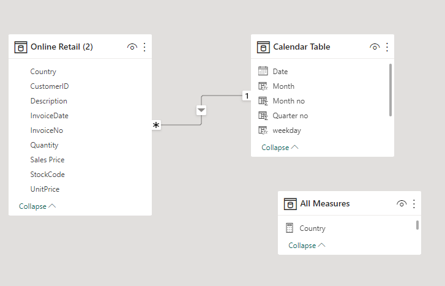
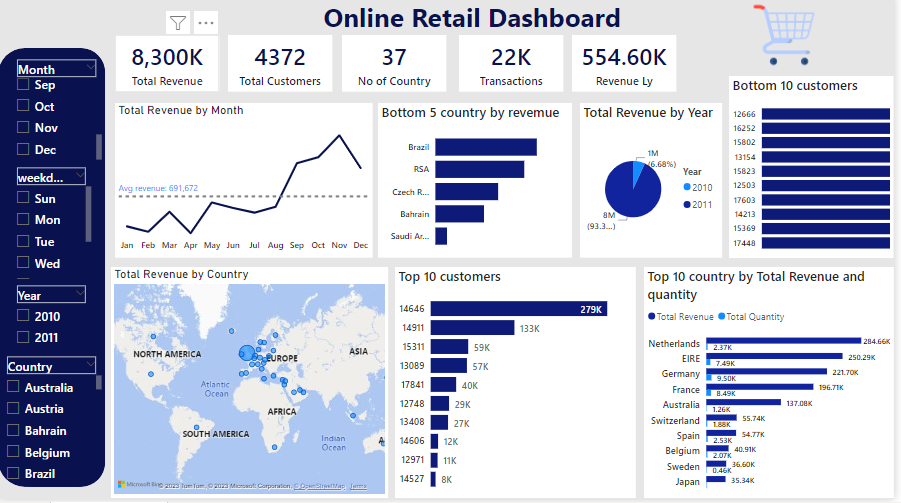
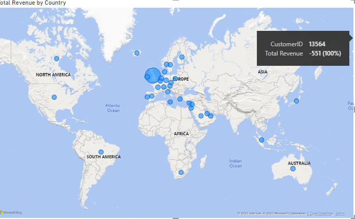

# Online Retail Store Analysis

## Introduction
An online retail store has hired me as a consultant to review their data and provide insights that would be valuable to the CEO and CMO of the business. The data set was gotten from Tata Forage Virtual Internship, Its was cleaned and analyze in power bi. 

## Problem Statement
The CEO of the retail store is interested to view the time series of the revenue data for the year 2011 only. He would like to view granular data by looking into revenue for each month. The CEO is interested in viewing the seasonal trends and wants to dig deeper into why these trends occur. This analysis will be helpful for the CEO to forecast for the next year.

The CMO is interested in viewing the top 10 countries which are generating the highest revenue. Additionally, the CMO is also interested in viewing the quantity sold along with the revenue generated. The CMO does not want to have the United Kingdom in this visual.

The CMO of the online retail store wants to view the information on the top 10 customers by revenue. He is interested in a visual that shows the greatest revenue generating customer at the start and gradually declines to the lower revenue generating customers. The CMO wants to target the higher revenue generating customers and ensure that they remain satisfied with their products

The CEO is looking to gain insights on the demand for their products. He wants to look at all countries and see which regions have the greatest demand for their products. Once the CEO gets an idea of the regions that have high demand, he will initiate an expansion strategy which will allow the company to target these areas and generate more business from these regions. He wants to view the entire data on a single view without the need to scroll or hover over the data points to identify the demand. There is no need to show data for the United Kingdom as the CEO is more interested in viewing the countries that have expansion opportunities. 

## Data Transformation
Data was efficiently cleaned and transformed with power query editor of power bi 

## Power Bi Concepts applied
•	Dax Concepts: Calendar Auto(), Year(), Month(), Weekday()

•	Data Modelling: star Schema 

## Data Modelling
Power bi automatically connected related tables resulting in a star schema model. The Online Table 2 and Calendar Table was connected together 

 

## Data Visualization

Based on my analysis, it appears that there are certain months of the year that experience significant growth. Specifically, the data reveals that revenue remains relatively stable in the first eight months, with an average monthly revenue of approximately $685,000. However, a notable upturn in revenue becomes evident starting in September, where it sees a 40% increase compared to the previous month. This upward trend persists until November, where it reaches its peak at $1.5 million, marking the highest point throughout the entire year. Unfortunately, the data for December is incomplete, making it impossible to draw any conclusions for that month. In summary, this analysis suggests that retail store sales are influenced by seasonal fluctuations, primarily occurring in the last four months of the year.

The top 10 countries with growth potential, excluding the UK due to its already high demand. The analysis highlights that countries like the Netherlands, Ireland, Germany, and France exhibit substantial unit sales and revenue generation. It is advisable to prioritize efforts in these countries to further tap into these promising markets.

 The top 10 customers who have made the most significant purchases from the store. The data indicates that there isn't a significant disparity in the purchasing patterns among these top customers. The customer with the highest revenue contribution only bought 17% more than the second-highest, suggesting that the business isn't overly reliant on a small number of customers to generate revenue. This underscores that the customers' bargaining power is relatively low, and the business is in a favorable position.

 

 The map chart provides a visual representation of regions that have contributed significantly to revenue compared to those that have not. Notably, aside from the UK, countries such as the Netherlands, Ireland, Germany, France, and Australia stand out as substantial revenue generators. It is advisable for the company to allocate more resources to these regions to further stimulate demand for its products.

The map also highlights that the majority of sales are concentrated in the European region, with limited activity in the American region. Furthermore, there is no discernible demand for the products in Africa, Asia, and Russia. This suggests an opportunity for the company to develop a new strategy aimed at these underperforming areas, potentially resulting in increased sales revenue and improved profitability.

 
To interact with the dataset click [here](https://app.powerbi.com/groups/me/reports/8d5dd07c-6064-43cd-93e1-3897b0dcfbc6/ReportSection?experience=power-bi)

